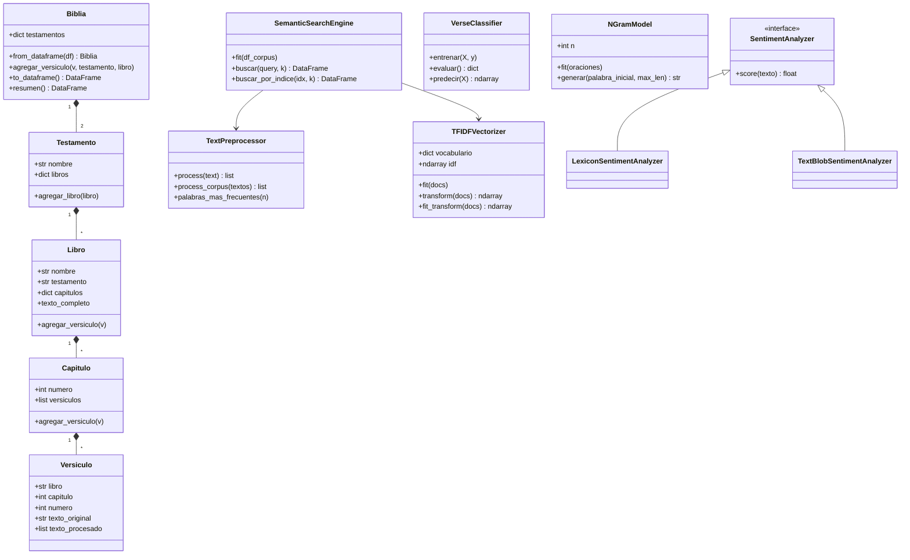

# Biblical Text Mining — Laboratorio 2

Sistema de análisis computacional de texto sobre el corpus bíblico:
preprocesamiento, TF-IDF (implementado desde cero), motor de búsqueda
semántico, clasificador de versículos, generador de texto con n-gramas
y análisis de sentimiento.

## Estructura del proyecto

```
biblical_text_mining/
├── data/                     # CSV del dataset (no versionado, ver abajo)
├── notebooks/                # exploración y generación de figuras del informe
├── src/
│   ├── __init__.py
│   ├── models.py             # Biblia, Testamento, Libro, Capitulo, Versiculo (OOP)
│   ├── preprocessing.py      # TextPreprocessor: pipeline de limpieza de texto
│   ├── tfidf.py               # TFIDFVectorizer + cosine_similarity (implementación propia)
│   ├── search_engine.py      # SemanticSearchEngine: buscador por similitud
│   ├── classifier.py         # VerseClassifier: predice libro a partir de un versículo
│   ├── ngram_model.py        # NGramModel: generador de texto (unigram/bigram/trigram/n)
│   ├── sentiment.py          # Análisis de sentimiento por versículo/capítulo/libro
│   └── visualization.py      # Funciones de gráficos (heatmap, PCA, wordcloud, etc.)
├── main.py                   # pipeline end-to-end
├── requirements.txt
└── README.md
```

## Dataset

Descargar desde https://www.kaggle.com/datasets/oswinrh/bible (o una versión
en español) y guardar el CSV en `data/`. **Ajustar `cargar_dataset()` en
`main.py`** según las columnas reales del archivo descargado — varían
entre versiones del dataset.

## Instalación

```bash
pip install -r requirements.txt
python main.py
```

## Diagrama de clases



## División de trabajo sugerida (equipo de 3)

- **Persona A:** `models.py`, `preprocessing.py`, `tfidf.py` (base que bloquea al resto)
- **Persona B:** `search_engine.py`, `visualization.py` (heatmap + PCA)
- **Persona C:** `classifier.py`, `ngram_model.py`, `sentiment.py`

## Notas de diseño

- TF-IDF y similitud de coseno están implementados desde cero en `tfidf.py`
  (sin usar `sklearn.feature_extraction.text.TfidfVectorizer` ni
  `sklearn.metrics.pairwise.cosine_similarity`), según lo exigido en el
  enunciado. `sklearn` sí se usa para PCA y para el clasificador, donde
  está permitido.
- `LexiconSentimentAnalyzer` es un baseline simple en español. Si el
  corpus elegido está en inglés, usar `TextBlobSentimentAnalyzer` en su
  lugar (ver `sentiment.py`).
