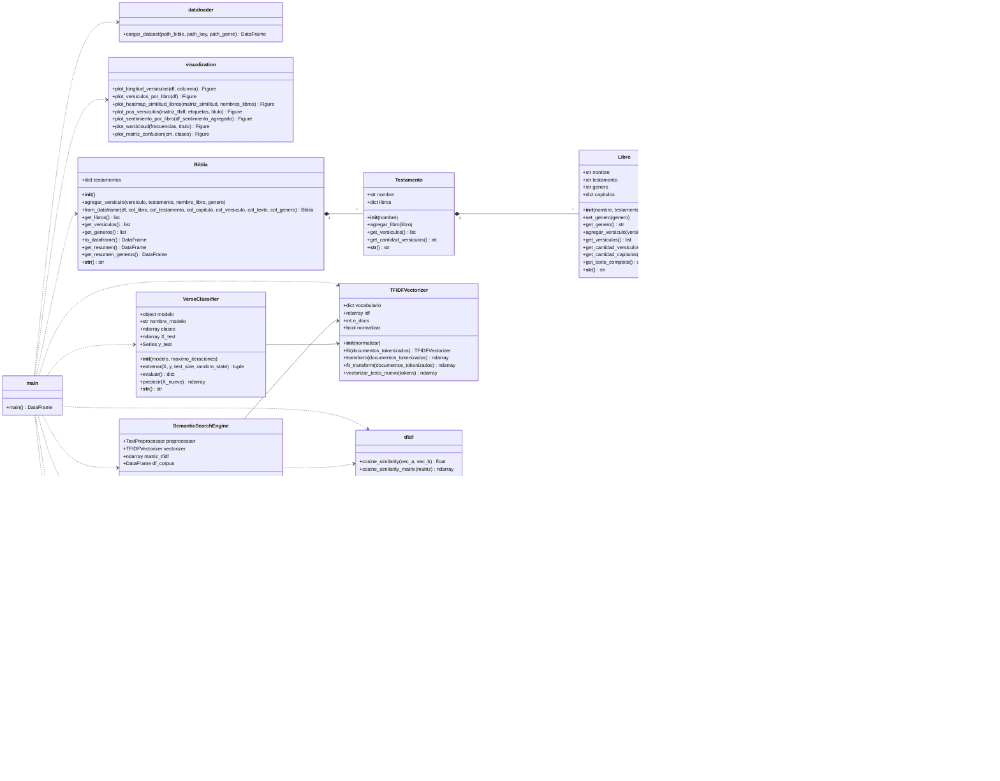

<a href="bibliabanner"></a>

<h1 align="center"> Taller 02 - Programación Científica </h1>

<p align = center>
<a href = "https://www.ucn.cl"></a>
<a href = "https://eic.ucn.cl"> </a>
</p>

## Biblical Text Mining — Laboratorio 2

El presente repositorio consiste en la implementación de un programa capaz de realizar análisis computacional de texto sobre el corpus bíblico, desarrollando labores de preprocesamiento, TF-IDF (implementado desde cero), motor de búsqueda
semántico, clasificador de versículos, generador de texto con n-gramas
y análisis de sentimiento.
Los datos para este taller fueron extraídos de https://www.kaggle.com/datasets/oswinrh/bible en la versión ASV (American Standard Version).

## Estructura del proyecto

```
biblical_text_mining/
├── data/                     
├── notebooks/            
├── src/
│   ├── __init__.py
│   ├── models.py 
|   ├── dataloader.py            
│   ├── preprocessing.py      
│   ├── tfidf.py              
│   ├── search_engine.py     
│   ├── classifier.py        
│   ├── ngram_model.py        
│   ├── sentiment.py          
│   └── visualization.py      
├── main.py                
├── requirements.txt
└── README.md
```

## Instalación

## Instalación
1. Clonar el repositorio y entrar en la carpeta:
``` bash
git clone https://github.com/Fifthtaschenmesser4/Taller02-ProgCien
```
2. Entrar en la raíz del proyecto:
```bash
cd Taller01-ProgCient
```
3. Descargar los requerimientos con el archivo __requirements.txt__:
``` bash
pip install -q -r requirements.txt
python main.py
```

## Diagrama de clases




## Integrantes
<table>
  <tr>
    <td align="center">
      <a href="https://github.com/martindroguett">
        
        <br />
        <sub><b>Martín Droguett Robledo</b></sub>
      </a>
    </td>
    <td align="center">
      <a href="https://github.com/Fifthtaschenmesser4">
        
        <br />
        <sub><b>Francisco Romero Opazo</b></sub>
      </a>
    </td>
        <td align="center">
      <a href="https://github.com/amelievalderrama-oss">
        
        <br />
        <sub><b>Amelie Valderrama</b></sub>
      </a>
    </td>
  </tr>
</table>